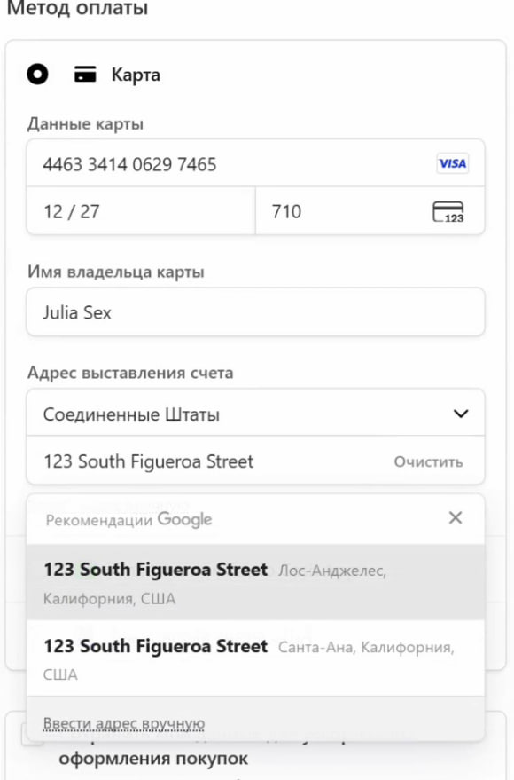

EN

# Card Generator For Stripe

## Overview
This Chrome extension, developed as part of an educational project for studying white-hat hacking, automatically generates and fills card details into Stripe payment forms for testing purposes. It is intended **solely for educational use** in controlled environments to demonstrate vulnerabilities in payment form handling.

> **⚠️ WARNING: This software is for educational purposes ONLY. Unauthorized use, distribution, or modification of this code is strictly prohibited and may violate applicable laws, including those related to intellectual property and financial regulations. Use responsibly and ONLY in environments where you have explicit permission.**

## Features
- Generates valid card numbers with a Luhn algorithm check digit.
- Automatically fills Stripe payment forms with card details, CVV, and billing information.
- Uses a `MutationObserver` to detect dynamically loaded forms.
- Supports specific Stripe checkout URLs (`https://checkout.stripe.com/*` and `https://*.stripe.com/*`).

## Installation
To install the extension for testing in a development environment:
1. Download and unzip the extension archive.
2. Open Chrome and navigate to `chrome://extensions/`.
3. Enable **Developer Mode** in the top-right corner.
4. Click **Load unpacked** and select the folder containing the unzipped extension files.
5. The extension will appear in your Chrome browser and activate on matching Stripe URLs.

## Screenshots
Below are some screenshots demonstrating the extension in action:

## Usage
- The extension automatically activates on Stripe payment pages.
- It generates a random card number starting with the prefix `446334140629`, a valid CVV, and fills in predefined billing details (e.g., name: "Julia Sex", address: "123 South Figueroa Street, Los Angeles, CA 90012").
- No user interaction is required; the form is filled as soon as it is detected.

This software is licensed for **educational use ONLY**. Unauthorized copying, modification, distribution, or use of this software, in whole or in part, is strictly prohibited without explicit permission from the author. Violators may be subject to legal action under applicable copyright and intellectual property laws.

## ⚠️ Disclaimer
This tool is provided for educational and research purposes ONLY. Use at your own risk. Developers are not responsible for any consequences arising from the use of this tool.
Please consider supporting Cursor development by purchasing a legitimate license if you find their product valuable for your workflow.
**It must not be used for any illegal activities, including unauthorized testing of live payment systems or services like Cursor Free Trial.** The author is not responsible for any misuse of this software. Always obtain explicit permission from system owners before conducting security testing.

## Development Notes
- The extension uses a content script (`content.js`) to handle form detection and filling.
- The `manifest.json` specifies the extension's permissions and target URLs.
- Ensure all form selectors match the target Stripe form structure for reliable operation.

----------------------

RU

# Генератор карт для Stripe

## Обзор
Это расширение для Chrome, разработанное в рамках образовательного проекта по изучению хакерских атак с использованием "белой шляпы", автоматически генерирует и вводит данные карты в платежные формы Stripe для целей тестирования. Он предназначен ** исключительно для использования в образовательных целях ** в контролируемых средах, чтобы продемонстрировать уязвимости в обработке платежных форм.

> **❗️ ВНИМАНИЕ: Данное программное обеспечение предназначено ТОЛЬКО для образовательных целей. Несанкционированное использование, распространение или модификация данного кода строго запрещены и могут нарушать применимые законы, в том числе касающиеся интеллектуальной собственности и финансовых правил. Используйте ответственно и ТОЛЬКО в тех случаях, когда у вас есть явное разрешение.**

## Особенности
- Генерирует действительные номера карт с помощью контрольной цифры алгоритма Луна.
- Автоматически заполняет платежные формы Stripe реквизитами карты, CVV и платежной информацией.
- Использует "MutationObserver" для обнаружения динамически загружаемых форм.
- Поддерживает определенные URL-адреса для проверки Stripe (`https://checkout.stripe.com/*` и `https://*.stripe.com /*`).

## Установка
Чтобы установить расширение для тестирования в среде разработки:
1. Загрузите и распакуйте архив с расширением.
2. Откройте Chrome и перейдите к "chrome://расширения/".
3. Включите режим разработчика в правом верхнем углу.
4. Нажмите "Загрузить распакованное" и выберите папку, содержащую распакованные файлы расширений.
5. Расширение появится в вашем браузере Chrome и активируется по соответствующим URL-адресам Stripe.

## Скриншоты
Ниже приведены несколько скриншотов, демонстрирующих расширение в действии:

## Использование
- Расширение автоматически активируется на страницах оплаты Stripe.
- Он генерирует случайный номер карты, начинающийся с префикса "446334140629", действительный CVV, и заполняет предварительно определенные платежные реквизиты (например, имя: "Джулия Секс", адрес: "Улица Южная Фигероа, 123, Лос-Анджелес, Калифорния, 90012").
- Никакого взаимодействия с пользователем не требуется; форма заполняется сразу же после ее обнаружения.

Данное программное обеспечение ТОЛЬКО для использования в образовательных целях. Несанкционированное копирование, модификация, распространение или использование данного программного обеспечения, полностью или частично, строго запрещено без явного разрешения автора. Нарушители могут быть привлечены к судебной ответственности в соответствии с применимыми законами об авторском праве и интеллектуальной собственности.

## ⚠️ Отказ от ответственности
Этот инструмент предоставляется исключительно в образовательных и исследовательских целях. Используйте его на свой страх и риск. Разработчики не несут ответственности за любые последствия, связанные с использованием этого инструмента.
Пожалуйста, рассмотрите возможность поддержки разработки Cursor путем приобретения законной лицензии, если вы считаете их продукт ценным для вашего рабочего процесса.
**Оно не должно использоваться для каких-либо незаконных действий, включая несанкционированное тестирование реальных платежных систем или сервисов, таких как бесплатная пробная версия Cursor.** Автор не несет ответственности за любое неправильное использование этого программного обеспечения. Перед проведением тестирования безопасности всегда получайте четкое разрешение от владельцев системы.

## Примечания по разработке
- Расширение использует скрипт содержимого (`content.js`) для обнаружения и заполнения форм.
- В "manifest.json" указаны разрешения расширения и целевые URL-адреса.
- Убедитесь, что все средства выбора форм соответствуют целевой структуре формы Stripe для надежной работы.